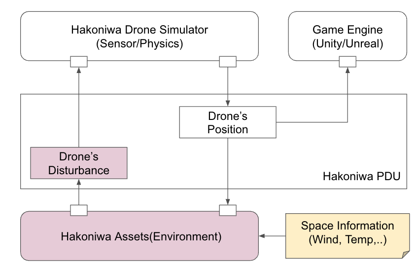

English ｜ [日本語](README-ja.md)

# What is this?

This document explains the simulation features of the Hakoniwa Drone Simulator, focusing on environmental factors. For instance, it aims to replicate the effects of wind in the simulation environment and apply realistic wind forces to the drone’s flight behavior.

# Hakoniwa’s Approach to Environmental Simulation

Hakoniwa is designed to provide reusable functionality without being dependent on specific technologies such as game engines. To achieve this, environmental data is managed in easily programmatic formats like `json`, allowing for flexible use in various programming languages.

When considering environmental factors in drone simulation, it's efficient to separate static and dynamic information. For example, position data is static and can easily be stored in a database. On the other hand, weather information (e.g., wind, temperature, humidity, rain) is dynamic and changes depending on time and location.

Thus, in Hakoniwa, environmental information is managed as follows:

- **Spatial Information**  
  Spatial information assigns a unique ID (area ID) to arbitrary areas. By using this area ID, spatial data for different regions can be easily referenced.

- **Spatial Property Information**  
  Properties like wind, temperature, and humidity are tied to specific areas. These properties can be linked to spatial information via the area ID.

Hakoniwa provides flexible and reusable simulation capabilities based on this design.

# Architecture



This architecture diagram illustrates the overall flow of environmental simulation within the Hakoniwa Drone Simulator.

1. **Processing of Environmental Information**  
   Hakoniwa assets monitor Hakoniwa PDU data and obtain the corresponding area ID from the drone's position information. Based on this area ID, the system reads the property data (e.g., wind, temperature, humidity) and triggers disturbance events for the target drone.

2. **Application of Disturbances and Simulation**  
   The Hakoniwa Drone Simulator uses the disturbances (e.g., wind effects) received from the environment to simulate the drone’s sensor and physical behavior. This allows for the realistic simulation of drone operations.

3. **Retrieving and Transmitting Drone Position Information**  
   The results of the simulation, including position and orientation data, are written back to the Hakoniwa PDU data. This data is then visualized in the game engine (Unity or Unreal Engine), where the disturbance events are automatically reflected.

# Data Structure Definition for Spatial Information

- **Coordinate system**: The ROS coordinate system is used.
- **Spatial definition**: Managed in `space_areas.json`, where area ranges are defined using AABB (axis-aligned bounding box).
- **Property definition**: Managed in `area_properties.json`, where attributes such as wind and temperature are associated with each area using `area_id`.

1. **`space_areas.json`**:
   - Defines each spatial area. Each area is assigned a unique `area_id`, and the bounds are defined using an AABB (minimum and maximum points).

2. **`area_properties.json`**:
   - Defines the properties (e.g., wind, temperature) for each area. These properties are linked to the spatial areas via `area_id`, making it easy to assign different properties to different spaces.

## 1. Spatial Definition (`space_areas.json`)

```json
{
  "space_areas": [
    {
      "area_id": "area_1",
      "bounds": {
        "min": { "x": 0, "y": 0, "z": 0 },   // Minimum point
        "max": { "x": 100, "y": 100, "z": 50 } // Maximum point
      }
    },
    {
      "area_id": "area_2",
      "bounds": {
        "min": { "x": 101, "y": 0, "z": 0 },
        "max": { "x": 200, "y": 100, "z": 50 }
      }
    }
  ]
}
```

## 2. Property Definition (`area_properties.json`)

```json
{
  "area_properties": [
    {
      "area_id": "area_1",
      "properties": {
        "wind": { 
          "velocity": { "x": 5.0, "y": 2.0, "z": -1.0 }  // Wind speed (m/s)
        },
        "temperature": 20.0  // Temperature (Celsius)
      }
    },
    {
      "area_id": "area_2",
      "properties": {
        "wind": { 
          "velocity": { "x": -3.0, "y": 1.0, "z": 0.0 }
        },
        "temperature": 25.0
      }
    }
  ]
}
```

# Class Design for Handling Spatial Information


This class design is intended to create a structure that can be easily extended for handling spatial information in Hakoniwa. The goal is to incorporate real-world spatial information definitions or other environmental settings. The initial implementation will be based on Hakoniwa specifications, with the intent to allow future customization and replacement.

1. **`HakoEnvEvent`**  
   - The main class responsible for managing environmental events such as wind and temperature.
   - It applies environmental information to drones and other simulation elements.

2. **`IHakoAreaPropAccessor` and `IHakoAreaAccessor` (Abstract Classes)**  
   - Interfaces for handling data from `area_properties.json` and `space_areas.json`.
   - They allow unified access to spatial and property information.
   - These abstract classes provide extensibility, allowing for future replacement of different spatial or property data sources.

3. **`HakoAreaPropAccessorImpl` and `HakoAreaAccessorImpl`**  
   - Concrete implementation classes that retrieve spatial and property information based on Hakoniwa specifications.
   - These classes fetch data from `space_areas.json` and `area_properties.json` and apply it to the simulation.

4. **`HakoAABBObjectSpace`**  
   - A class that defines spatial regions using axis-aligned bounding boxes (AABB). This allows for efficient definition and management of spatial regions.

This design links spatial information and property information via `area_id`, making it easy to apply different properties (e.g., wind speed and temperature) to different areas. By using abstract classes, this design also provides flexibility for future expansion and support for other specifications.

# Sample Implementation

Sample implementation is available here: [Hakoniwa Drone's Environment Assets](https://github.com/toppers/hakoniwa-px4sim/tree/main/drone_api/assets)

- **`hako_env_event.py`**: Contains the implementation of the HakoEnvEvent, which simulates environmental events.
- **`lib`**: Contains Python implementations of the class designs, including access logic for spatial and property information.
- **`config`**: Stores sample environment data such as `space_areas.json` and `area_properties.json`.
- **`tests`**: Contains test scripts to verify the functionality and behavior of the implementation.

Using this sample implementation, you can set up the environment and try the simulation as needed.

# Demo

Here’s a demo showcasing the addition of wind as an environmental model in the Hakoniwa Drone Simulator. A 1 m/sec diagonal wind pushes the drone, causing it to drift.

[Demo Video](https://www.youtube.com/watch?v=KBPrrA1XC4U)
